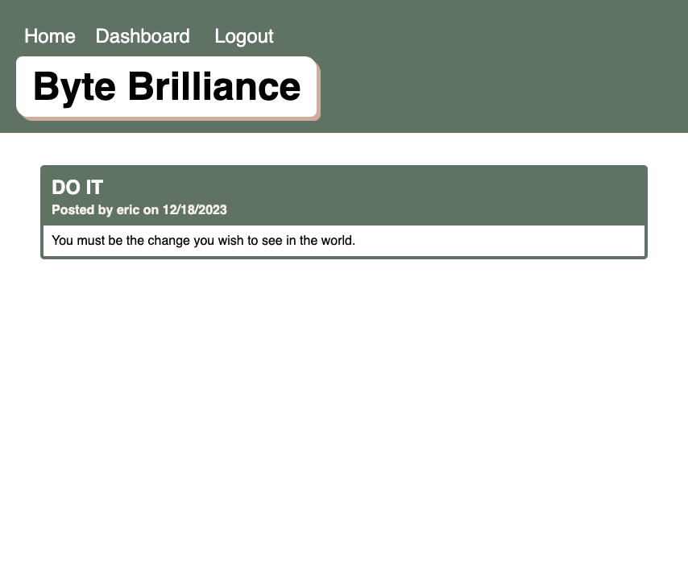

# TechBlog - Byte Brilliance

## Description
The Tech Blog is an online platform where users can generate, explore, and engage in discussions on blog posts centered around technology. It serves as a space for tech enthusiasts to exchange their expertise and perspectives with a wider audience.

## Table of Contents
- [Description](#description)
- [Installation](#installation)
- [Usage](#usage)
- [Testing](#testing)
- [Contributors](#contributors)
- [Questions](#questions)

## Installation
Clone repo => install dependencies => npm run start/node server

## Usage

Deployed URL: https://bytebrilliance-kztk.onrender.com

## Testing
None

## Contributors
None

## Questions
Please send your questions, https://github.com/coterone